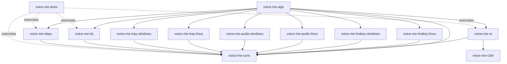

# Architecture Spine — voice-me

## Design Paradigm

**Hexagonal / Ports-and-Adapters.** `voice-me-core` is the hexagon: platform-agnostic domain types, `AppState`, `AppEvent`, and the full set of port traits — `HotkeyPort`, `VirtualMicPort`, `TrayPort`, `TtsPort`, `DependencyProvisioningPort`, and `SettingsStore`. Everything else is an adapter plugged into a port — driving adapters trigger the app (the UI, per-OS hotkey listeners); driven adapters are what the app calls out to (virtual mic playback, tray presence, the TTS sidecar, dependency provisioning). `SettingsStore` is the one exception: its implementation lives inside `voice-me-core` itself rather than a separate adapter crate (see AD-6) since local file I/O via `directories` doesn't vary by OS the way hotkey/audio/tray do. No adapter depends on another adapter; all cross-adapter communication passes through `voice-me-core`.



## Invariants & Rules

### AD-1 — Hexagonal paradigm; core has zero adapter dependencies

- **Binds:** all crates
- **Prevents:** business logic leaking into a platform-specific or UI crate, and adapters reaching into each other directly
- **Rule:** `voice-me-core` depends on no other `voice-me-*` crate. Every adapter crate depends on `voice-me-core` for its port trait and domain types, never on a sibling adapter. All cross-adapter effects flow through `AppState`/`AppEvent` (AD-3).

### AD-2 — Per-OS adapters are separate crates, not `cfg`-gated modules

- **Binds:** FR-2 (background/tray), FR-3 (hotkey), FR-6 (virtual mic)
- **Prevents:** one crate accumulating both platforms' dependencies, and Linux-only work pulling in Windows-only build requirements
- **Rule:** each OS-specific capability ships as its own crate — `voice-me-hotkey-{linux,windows}`, `voice-me-audio-{linux,windows}`, and `voice-me-tray-{linux,windows}` (system tray APIs differ per OS just as much as hotkey/audio, and neither GPUI nor gpui-kit provide one — see Deferred) — each implementing the matching `voice-me-core` port trait (`HotkeyPort`, `VirtualMicPort`, `TrayPort`). `voice-me-app` selects the right crates per target via `[target.'cfg(...)'.dependencies]` in `Cargo.toml`. A future macOS adapter set is additive, not a rewrite.

### AD-3 — Single `AppState`, single `AppEvent` channel

- **Binds:** FR-1, FR-2, FR-3, FR-4, FR-5, FR-7, FR-8
- **Prevents:** divergent per-adapter copies of settings/state, and each adapter inventing its own callback or polling mechanism to reach the UI
- **Rule:** `voice-me-core` owns the one `AppState` (hotkey binding, active Reference Voice Sample, UI language, selected Virtual Microphone device). No adapter mutates it directly — only through `voice-me-core` use-case functions. Every adapter signals the app through one shared `AppEvent` enum over one channel; every adapter (including `voice-me-deps`, per AD-9) holds only the sender half. `voice-me-app` (the composition root) owns the single receiver and is the one place that pumps `AppEvent`s into `voice-me-core`'s use-case functions and forwards UI-relevant results to `voice-me-ui`, which turns them into GPUI entity updates via `cx.spawn`. No adapter, including `voice-me-ui`, holds or reads the receiver directly.

### AD-4 — One domain error type; adapters map into it at the boundary

- **Binds:** all crates
- **Rule:** `voice-me-core` defines a `thiserror`-based error enum. Each adapter converts its own failures (IPC error, driver error, I/O error) into that enum at the port boundary. `voice-me-app` aggregates with `anyhow` at the composition root. No adapter-specific error type crosses a crate boundary.
- **Prevents:** ad-hoc error types leaking into the UI or into other adapters.

### AD-5 — Tokio runs alongside GPUI's own executor, bridged deliberately

- **Binds:** FR-5 (TTS generation), FR-7 (dependency provisioning)
- **Prevents:** each async-needing adapter picking a different (or no) runtime, and assuming GPUI's own executor is Tokio-compatible
- **Rule:** `voice-me-tts` (sidecar IPC) and `voice-me-deps` (HTTP downloads) run their async work on Tokio. GPUI's own `cx.spawn`/`cx.background_spawn` is reserved for UI-side async work. The bridge between them is **one** small in-house reimplementation of Zed's `gpui_tokio` pattern (a `Global` holding a `tokio::runtime::Handle`, plus a `Tokio::spawn` wrapping `cx.background_spawn`), owned by `voice-me-core` and exposed to both `voice-me-tts` and `voice-me-deps` as a single shared utility — not reinvented per adapter. **Not** a direct dependency on Zed's `gpui_tokio` crate: it's a workspace-internal path dependency inside `zed-industries/zed`, not independently publishable, and pulling it in would drag a second, type-incompatible `gpui` instance alongside the one `gpui-kit` already pins (see Stack). `[ADOPTED pattern, in-house implementation]` — the bridging *technique* is confirmed as Zed's own; the *crate* is not reusable as-is.

### AD-6 — Settings and user assets live in core-owned locations, never touched directly by adapters

- **Binds:** FR-1, FR-3, FR-8
- **Prevents:** an adapter reading or writing the settings file (or the Reference Voice Sample audio) directly and drifting from what `voice-me-core` believes is true; two designs disagreeing on whether the active Reference Voice Sample is a path or an ID+manifest
- **Rule:** one TOML settings file at the OS config directory, and Reference Voice Sample audio files at the OS data directory — both resolved via the `directories` crate — behind the `SettingsStore` port, implemented inside `voice-me-core` itself (not a separate adapter crate — see Design Paradigm). `AppState`'s active Reference Voice Sample field is a `PathBuf` into that data directory, not an ID with a separate manifest/index. Adapters (including `voice-me-ui`'s recorder) hand recorded/imported audio to `voice-me-core` to store; they never write to the data directory themselves and read settings only through `AppState`. Large remotely-fetched runtime assets (bundled Python runtime, model weights, the Windows driver installer) are **out of `SettingsStore`'s scope** — they live in a separate OS *cache* directory (also via `directories`), owned and written only by `voice-me-deps` behind `DependencyProvisioningPort`, never through `SettingsStore`.

### AD-7 — Open source, GitHub-native CI/release, first-party dependency hosting

- **Binds:** FR-7 (dependency management), overall distribution
- **Prevents:** `voice-me-deps` pulling runtime assets from ad-hoc third-party URLs with no versioning or trust boundary
- **Rule:** GitHub Actions builds Linux and Windows separately (no macOS job in v1); binaries publish to GitHub Releases of this repo. Any remotely-fetched runtime asset that (a) is small enough for a GitHub Release asset and (b) voice-me is legally permitted to redistribute (the bundled Python runtime, the Windows Virtual-Audio-Driver installer — both open source and small) is mirrored there — one trusted, versioned source `voice-me-deps` pulls from. Chatterbox's own model weights are the one asset this rule does **not** yet cover: their size (plausibly multi-GB, untested against GitHub Releases' practical limits) and redistribution terms are both unverified — see Deferred. `voice-me-deps`'s `DependencyProvisioningPort` must support fetching from more than one trusted source (this repo's releases, and/or the model's own origin) rather than hard-coding "GitHub Releases only," precisely because that fallback may be needed.

### AD-8 — No network egress outside `voice-me-deps`'s declared GitHub-Releases fetches

- **Binds:** all crates
- **Prevents:** any crate silently phoning home — a cloud fallback added to `voice-me-tts`, telemetry slipped into `voice-me-ui`, or any other undeclared network call — which would break the PRD's local-only/no-telemetry guarantee without anyone deciding it
- **Rule:** the only network calls in the whole app are `voice-me-deps` fetching versioned assets from its trusted sources (AD-7). Every other crate, including `voice-me-tts`'s sidecar IPC, is loopback/local-only. Enforced with a CI check (a `cargo-deny` ban list, or a workspace-wide `grep` for HTTP-client crates outside `voice-me-deps`'s `Cargo.toml`) rather than relying on code-review discipline alone — solo development is exactly the setting where a silent violation goes unnoticed without an automated check. Adding any other network call is an architectural change, not a local one — it revisits this AD.

### AD-9 — Hardware capability detection is core-owned, not adapter-to-adapter

- **Binds:** FR-5 (TTS generation), FR-7 (dependency check / GPU fallback)
- **Prevents:** `voice-me-tts` querying `voice-me-deps` directly for GPU availability, which would violate AD-1's no-adapter-to-adapter rule
- **Rule:** `voice-me-deps` detects GPU acceleration availability as part of its Dependency Check and reports the result **only** by emitting it on the shared `AppEvent` channel (AD-3) — never by calling a `voice-me-core` use-case function directly. `voice-me-app` (the sole `AppEvent` receiver) routes that event into `voice-me-core`, which records it in `AppState`. `voice-me-tts` reads the capability (full model vs. Chatterbox-Nano CPU fallback) from `AppState`/its `TtsPort` call parameters — it never calls `voice-me-deps` itself, and `voice-me-deps` never calls `voice-me-core` directly either.

### AD-10 — Speak Action sequencing and sidecar supervision are explicit contracts

- **Binds:** FR-4 (Prompt Overlay dismiss), FR-5 (TTS generation)
- **Prevents:** the Prompt Overlay's "closes instantly on Enter" guarantee silently depending on how fast TTS happens to run, and sidecar crash/restart logic leaking into `voice-me-core` or `voice-me-ui`
- **Rule:** dismissing the Prompt Overlay on Enter is synchronous and unconditional — `voice-me-ui` never waits on `TtsPort::generate`. Generation runs as a Tokio task (AD-5) dispatched immediately after dismissal; its result reaches the UI later via `AppEvent` (AD-3). Sidecar Process lifecycle (start, health-check, crash-restart) is owned entirely inside `voice-me-tts`; failures surface to `voice-me-core` only as the domain error enum (AD-4), never as a process-management detail.

### AD-11 — One shared audio buffer type crosses the TTS→Virtual Microphone boundary

- **Binds:** FR-5 (TTS generation), FR-6 (Virtual Microphone playback)
- **Prevents:** `voice-me-tts` and `voice-me-audio-{linux,windows}` independently assuming a sample rate, bit depth, or channel layout, and only discovering the mismatch as garbled audio at runtime
- **Rule:** `voice-me-core` defines one audio buffer type (format, sample rate, channel count — exact values are a Deferred detail, not the invariant) that `TtsPort::generate` returns and `VirtualMicPort::play` accepts. Neither port trait uses a raw byte slice or a per-adapter-defined struct; any format conversion (e.g. Chatterbox's native output rate to whatever the virtual mic driver expects) happens inside the `voice-me-audio-*` adapter, never by the two adapters agreeing informally.

## Consistency Conventions

| Concern | Convention |
| --- | --- |
| Naming | Crates: kebab-case, `voice-me-` prefixed. Types: PascalCase. Modules/files: snake_case. Standard Rust convention throughout — no project-specific scheme. |
| Data & formats | Settings: single TOML file (AD-6). Errors: one domain enum per AD-4. No IDs/timestamps needed at this altitude — single-user, single-machine, no multi-record domain data. |
| State & cross-cutting | Mutation only through `voice-me-core` use cases (AD-3). Logging via `tracing`, initialized once in `voice-me-app` — no crate sets up its own logger or log-level scheme. |

## Stack

*Every version below was checked against crates.io/docs.rs/the Rust blog on 2026-09-20 — re-verify before use if implementation starts significantly later.*

| Name | Version |
| --- | --- |
| Rust | 1.98.1, edition 2024 |
| gpui-kit | 0.6.4 (crates.io) — the app's only dependency on GPUI; never add `gpui` directly |
| GPUI | not a direct dependency — arrives transitively via gpui-kit's own pin, currently the third-party `gpui-pre@0.3.5` crates.io snapshot ("snapshot of zed@d89e9c2"), not the official `gpui` crate (crates.io `0.2.2`, confirmed stale vs. zed's git `main` — zed-industries/zed#46486) and not a live git dependency. Bumping GPUI means bumping gpui-kit, not editing a rev in this repo. |
| thiserror | 2.0.20 |
| anyhow | 1.0.103 |
| tokio | latest stable — pin at implementation time |
| tracing | latest stable — pin at implementation time |
| directories | latest stable — pin at implementation time |

## Structural Seed

```text
voice-me/
  Cargo.toml                  # [workspace] members
  crates/
    voice-me-app/             # bin: composition root - GPUI entry, Tokio+gpui_tokio bridge setup, tracing init, per-OS adapter wiring
    voice-me-core/            # lib: domain types, AppState, AppEvent, port traits (HotkeyPort, VirtualMicPort, TtsPort, SettingsStore), domain error enum
    voice-me-ui/               # lib: gpui-kit views - Prompt Overlay, settings, voice setup, tray menu
    voice-me-hotkey-linux/     # lib: HotkeyPort adapter for Linux
    voice-me-hotkey-windows/   # lib: HotkeyPort adapter for Windows
    voice-me-audio-linux/      # lib: VirtualMicPort adapter - PipeWire/PulseAudio null-sink
    voice-me-audio-windows/    # lib: VirtualMicPort adapter - controls the signed Virtual-Audio-Driver
    voice-me-tray-linux/       # lib: TrayPort adapter - Linux system tray
    voice-me-tray-windows/     # lib: TrayPort adapter - Windows system tray
    voice-me-tts/               # lib: TtsPort adapter - Sidecar Process lifecycle + IPC to Chatterbox
    voice-me-deps/              # lib: dependency detection/provisioning, pulls from this repo's GitHub Releases
    voice-me-i18n/              # lib: TR/EN string catalogs
    voice-me-tests/             # test-only: black-box integration tests against the lib crates
```

**Deployment & environments.** Two environments only: developer machine (build + run) and end-user machine (run only) — no server/cloud tier. CI is GitHub Actions with separate `ubuntu-latest` and `windows-latest` jobs (no macOS job in v1); release artifacts and remotely-fetched runtime assets both live on this repo's GitHub Releases (AD-7). No auto-update mechanism is decided for v1 (see Deferred).

## Capability → Architecture Map

| Capability / Area | Lives in | Governed by |
| --- | --- | --- |
| FR-1 Voice Setup | voice-me-ui, voice-me-core | AD-3, AD-6 |
| FR-2 Background/tray operation | voice-me-app, voice-me-tray-linux, voice-me-tray-windows | AD-1, AD-2, AD-3 |
| FR-3 Global hotkey configuration | voice-me-hotkey-linux, voice-me-hotkey-windows | AD-1, AD-2 |
| FR-4 Prompt Overlay summon/type/dismiss | voice-me-ui | AD-1, AD-3, AD-10 |
| FR-5 TTS generation via the sidecar | voice-me-tts | AD-1, AD-4, AD-5, AD-8, AD-9, AD-10, AD-11 |
| FR-6 Playback through the Virtual Microphone | voice-me-audio-linux, voice-me-audio-windows | AD-1, AD-2, AD-11 |
| FR-7 Dependency Check and provisioning | voice-me-deps | AD-4, AD-5, AD-7, AD-8, AD-9 |
| FR-8 Turkish/English UI | voice-me-ui, voice-me-i18n | — |
| FR-9 gpui-kit look & feel | voice-me-ui | external: gpui-kit-design-guides |

## Deferred

- **Chatterbox model-weight size vs. GitHub Releases' hosting limits, and whether the weights are legally redistributable at all (AD-7).** Both unverified. If either fails, `voice-me-deps`'s `DependencyProvisioningPort` falls back to fetching weights from the model's own origin instead of this repo's mirror — the port is designed to support more than one source specifically for this reason. Resolve before `voice-me-deps` is implemented.
- **Exact audio buffer format (sample rate, bit depth, channel layout) for the shared type in AD-11.** The invariant (one shared type, no informal agreement between adapters) is fixed; the specific values depend on what Chatterbox actually outputs and what each `voice-me-audio-*` backend expects, checked when those crates are built.
- **Tray half of PRD Open Question 6 — resolved on Linux (Story 2.1).** `voice-me-tray-linux` uses the `gpui-tray` crate (v0.1, Apache-2.0, published on crates.io, github.com/kagenokeiyou/gpui-tray) instead of the unverified "Adabraka GPUI" fork: it's native to GPUI/gpui-kit (tray menus are plain `gpui::MenuItem`s dispatching ordinary GPUI actions via `cx.on_action`, no second event loop to bridge) and ships a `gpui-kit` feature flag matching gpui-kit 0.6+, avoiding its default feature's pinned git dependency on Zed's own `gpui`. `TrayPort::show` gained a `cx: &mut gpui_kit::App` parameter so adapters can build the native tray item and dispatch actions through it — `voice-me-core` now depends on `gpui-kit` for this context type only, never on `gpui-tray` itself, which stays confined to the `voice-me-tray-*` adapters (AD-2 holds). Verified via `crates/voice-me-tray-linux/examples/spike.rs`: the adapter runs without error and claims the well-known `org.kde.StatusNotifierItem-<pid>-1` DBus name per the freedesktop StatusNotifierItem spec — confirmed by `busctl --user list` while the example ran. Full pixel-level visual confirmation (icon actually rendering in a panel) wasn't captured in this dev environment (screenshot tooling here is sandboxed), but GNOME's AppIndicator extension is installed and enabled on this machine, and DBus-level registration succeeding is the operative proof the adapter works. Fallback if `gpui-tray` ever proves broken: `tray-icon` (tauri-apps, mature, actively maintained, cross-platform) — framework-agnostic, would need its own event-receiver pumped from somewhere in `voice-me-app`. **Windows deferred** (Story 2.1 explicit scope decision): this dev environment has no Windows Rust target or cross-compile toolchain installed, so `voice-me-tray-windows` cannot be built or run here. It stays a `todo!()` stub (signature updated to match the new `TrayPort::show(&self, cx: &mut gpui_kit::App)`). Intended approach when Windows access exists: the same `gpui-tray` crate, whose Windows backend uses `Shell_NotifyIconW` plus a hidden top-level window and Win32 menus — resolve and verify before implementing `voice-me-hotkey-windows`/other Windows adapters that assume tray presence.
- **Hotkey half of PRD Open Question 6 — still unresolved.** Only the tray half was in scope for Story 2.1 (above); whether GPUI/gpui-kit (or a hand-rolled per-OS shim) can deliver global-hotkey capture, including while a fullscreen game holds focus, remains unverified. Resolve before implementing `voice-me-hotkey-linux`/`voice-me-hotkey-windows` in Story 2.3.
- IPC framing between `voice-me-tts` and the Python sidecar (stdio JSON-lines vs. a local socket) — an implementation detail hidden behind `TtsPort`; either choice satisfies AD-1/AD-5.
- Windows `Virtual-Audio-Driver` control mechanism (named pipe vs. an alternative) — PRD Open Question 2; must resolve before `voice-me-audio-windows` is implemented.
- Anti-cheat compatibility of the chosen hotkey-capture approach — PRD Open Question 3; investigate before committing `voice-me-hotkey-windows`/`-linux`'s implementation.
- Exact tray UX per OS (icon, menu contents) — a UI/UX detail, not an architectural invariant.
- Auto-update mechanism — not needed for v1; revisit once v1 ships.
- macOS adapters (`voice-me-hotkey-macos`, `voice-me-audio-macos`) — deferred past v1; AD-2 already makes this additive.
- Exact settings TOML schema (field names/types) — an implementation detail once `voice-me-core` is scaffolded, bound only by AD-6's ownership rule.
- Exact shape of the in-house Tokio/GPUI bridge (AD-5) — small, low-risk, but not yet written; implemented against gpui-kit's re-exported `gpui` types, not Zed's own.
- Pinning policy inconsistency: `thiserror`/`anyhow` are pinned to exact patch versions while `tokio`/`tracing`/`directories` are left "latest stable" — both approaches carry equal staleness risk since no implementation date is committed yet; normalize at implementation time (either re-verify all five, or drop the specific patch numbers).
