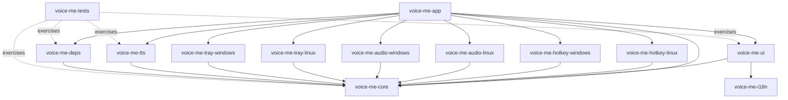

# Architecture Spine — voice-me

## Design Paradigm

**Hexagonal / Ports-and-Adapters.** `voice-me-core` is the hexagon: platform-agnostic domain types, `AppState`, `AppEvent`, and the full set of port traits — `HotkeyPort`, `VirtualMicPort`, `TrayPort`, `TtsPort`, `DependencyProvisioningPort`, and `SettingsStore`. Everything else is an adapter plugged into a port — driving adapters trigger the app (the UI, per-OS hotkey listeners); driven adapters are what the app calls out to (virtual mic playback, tray presence, the in-process TTS engine, dependency provisioning). `SettingsStore` is the one exception: its implementation lives inside `voice-me-core` itself rather than a separate adapter crate (see AD-6) since local file I/O via `directories` doesn't vary by OS the way hotkey/audio/tray do. No adapter depends on another adapter; all cross-adapter communication passes through `voice-me-core`.



## Invariants & Rules

### AD-1 — Hexagonal paradigm; core has zero adapter dependencies

- **Binds:** all crates
- **Prevents:** business logic leaking into a platform-specific or UI crate, and adapters reaching into each other directly
- **Rule:** `voice-me-core` depends on no other `voice-me-*` crate. Every adapter crate depends on `voice-me-core` for its port trait and domain types, never on a sibling adapter. All cross-adapter effects flow through `AppState`/`AppEvent` (AD-3).

### AD-2 — Per-OS adapters are separate crates, not `cfg`-gated modules

- **Binds:** FR-2 (background/tray), FR-3 (hotkey), FR-6 (virtual mic)
- **Prevents:** one crate accumulating both platforms' dependencies, and Linux-only work pulling in Windows-only build requirements
- **Rule:** each OS-specific capability ships as its own crate — `voice-me-hotkey-{linux,windows}`, `voice-me-audio-{linux,windows}`, and `voice-me-tray-{linux,windows}` (system tray APIs differ per OS just as much as hotkey/audio, and neither GPUI nor gpui-kit provide one — see Deferred) — each implementing the matching `voice-me-core` port trait (`HotkeyPort`, `VirtualMicPort`, `TrayPort`). `voice-me-app` selects the right crates per target via `[target.'cfg(...)'.dependencies]` in `Cargo.toml`. A future macOS adapter set is additive, not a rewrite. The instant system-voice backend follows the same rule (2026-09-23): `voice-me-tts-system-linux` (eSpeak NG) and `voice-me-tts-system-windows` (WinRT `SpeechSynthesizer`), wired in the composition root; a macOS crate joins them when macOS does.

### AD-3 — Single `AppState`, single `AppEvent` channel

- **Binds:** FR-1, FR-2, FR-3, FR-4, FR-5, FR-7, FR-8
- **Prevents:** divergent per-adapter copies of settings/state, and each adapter inventing its own callback or polling mechanism to reach the UI
- **Rule:** `voice-me-core` owns the one `AppState` (hotkey binding, active Reference Voice Sample, UI language, selected Virtual Microphone device). No adapter mutates it directly — only through `voice-me-core` use-case functions. Every adapter signals the app through one shared `AppEvent` enum over one channel; every adapter (including `voice-me-deps`, per AD-9) holds only the sender half. `voice-me-app` (the composition root) owns the single receiver and is the one place that pumps `AppEvent`s into `voice-me-core`'s use-case functions and forwards UI-relevant results to `voice-me-ui`, which turns them into GPUI entity updates via `cx.spawn`. No adapter, including `voice-me-ui`, holds or reads the receiver directly.

### AD-4 — One domain error type; adapters map into it at the boundary

- **Binds:** all crates
- **Rule:** `voice-me-core` defines a `thiserror`-based error enum. Each adapter converts its own failures (inference/session error, driver error, I/O error) into that enum at the port boundary. `voice-me-app` aggregates with `anyhow` at the composition root. No adapter-specific error type crosses a crate boundary.
- **Prevents:** ad-hoc error types leaking into the UI or into other adapters.

### AD-5 — Tokio runs alongside GPUI's own executor, bridged deliberately

- **Binds:** FR-5 (TTS generation), FR-7 (dependency provisioning)
- **Prevents:** each async-needing adapter picking a different (or no) runtime, assuming GPUI's own executor is Tokio-compatible, and — since AD-12 moved inference in-process — a multi-second synchronous ONNX run blocking the UI or an async executor thread
- **Rule:** `voice-me-tts` (ONNX inference, AD-12) and `voice-me-deps` (HTTP downloads) run their work on Tokio. `voice-me-deps`' downloads are genuinely async I/O; `voice-me-tts`' generation is CPU/GPU-bound and therefore runs on `tokio::task::spawn_blocking` (one in-flight generation at a time — see AD-10), never directly on an async worker. GPUI's own `cx.spawn`/`cx.background_spawn` is reserved for UI-side async work. The bridge between them is **one** small in-house reimplementation of Zed's `gpui_tokio` pattern (a `Global` holding a `tokio::runtime::Handle`, plus a `Tokio::spawn` wrapping `cx.background_spawn`), owned by `voice-me-core` and exposed to both `voice-me-tts` and `voice-me-deps` as a single shared utility — not reinvented per adapter. **Not** a direct dependency on Zed's `gpui_tokio` crate: it's a workspace-internal path dependency inside `zed-industries/zed`, not independently publishable, and pulling it in would drag a second, type-incompatible `gpui` instance alongside the one `gpui-kit` already pins (see Stack). `[ADOPTED pattern, in-house implementation]` — the bridging *technique* is confirmed as Zed's own; the *crate* is not reusable as-is.

### AD-6 — Settings and user assets live in core-owned locations, never touched directly by adapters

- **Binds:** FR-1, FR-3, FR-8
- **Prevents:** an adapter reading or writing the settings file (or the Reference Voice Sample audio) directly and drifting from what `voice-me-core` believes is true; two designs disagreeing on whether the active Reference Voice Sample is a path or an ID+manifest
- **Rule:** one TOML settings file at the OS config directory, and Reference Voice Sample audio files at the OS data directory — both resolved via the `directories` crate — behind the `SettingsStore` port, implemented inside `voice-me-core` itself (not a separate adapter crate — see Design Paradigm). `AppState`'s active Reference Voice Sample field is a `PathBuf` into that data directory, not an ID with a separate manifest/index. Adapters (including `voice-me-ui`'s recorder) hand recorded/imported audio to `voice-me-core` to store; they never write to the data directory themselves and read settings only through `AppState`. Large remotely-fetched runtime assets (the ONNX Runtime shared library and its execution providers, the ONNX model weights, the Windows driver installer) are **out of `SettingsStore`'s scope** — they live in a separate OS *cache* directory (also via `directories`), owned and written only by `voice-me-deps` behind `DependencyProvisioningPort`, never through `SettingsStore`.

### AD-7 — Open source, GitHub-native CI/release, first-party dependency hosting, one artefact per OS carrying every backend

- **Binds:** FR-7 (dependency management), overall distribution
- **Prevents:** `voice-me-deps` pulling runtime assets from ad-hoc third-party URLs with no versioning or trust boundary
- **Rule:** GitHub Actions builds Linux and Windows separately (no macOS job in v1); binaries publish to GitHub Releases of this repo. **v1 ships one executable per OS with every backend compiled in, and the user selects the backend inside the app** (product-owner direction, 2026-09-22, reversing the 2026-09-21 download-time-variant direction). Each backend is its own adapter crate behind `TtsPort` — `voice-me-tts-onnx` (CPU/CUDA/WebGPU over one ONNX Runtime) and `voice-me-tts-remote` (DeepInfra, fal.ai) — wired in the composition root. Cargo features exist only to exclude a backend from a *development* build; they never define a shipped product. The asset requirements below are therefore per **backend**, not per download:

  | Backend | ONNX Runtime it needs | Language-model weights | Notes |
  | --- | --- | --- | --- |
  | CPU | `onnxruntime-linux-x64-1.28.2.tgz` core library, 8.7 MB, no provider libs | `language_model_q4` (354 MB) | The floor; always buildable, always shipped, the only variant Story 2.5 verified |
  | CUDA | `onnxruntime-linux-x64-gpu_cuda12` (404 MB) or `gpu_cuda13` (230 MB), incl. `libonnxruntime_providers_cuda.so` | `language_model_fp16` (1.04 GB) | Needs an sm_60-or-newer NVIDIA GPU; unverified — no such hardware on the dev machine |
  | WebGPU | **No Microsoft release asset exists** — requires ONNX Runtime built from source with `--use_webgpu --build_shared_lib`, mirrored here per this AD | `language_model_q4` or `_fp16` per device `shaderFloat16` | Vendor-neutral GPU path over Vulkan/D3D12; the build is CI's job, not the user's |
  | Piper | the same core CPU library, no provider libs | one voice, ~63 MB (`<voice>.onnx` + `.onnx.json`) from `rhasspy/piper-voices` at a pinned revision, not mirrored (per-voice licences) | `voice-me-tts-piper`; CPU execution provider only (added 2026-09-24) |
  | Remote | none | none | `voice-me-tts-remote` — a `TtsPort` adapter, not an `ort` configuration. Granted 2026-09-22 by PRD Open Question 7; governed by AD-13 |

  **Variant names leave release artefact names entirely**; a binary is self-describing by reporting which backends it carries, which one is selected, and what that selection actually acquired at session build (AD-9). 

  **One runtime, every provider.** Execution providers are ONNX Runtime *C* libraries and `ort` commits exactly one `libonnxruntime` per process, so "every backend in one binary" is true of the Rust adapters but not automatically of the runtime beneath them. CI therefore builds ONNX Runtime from source with `--use_cuda --use_webgpu --build_shared_lib` and mirrors that single distribution per this AD; `voice-me-deps` provisions it and `voice-me-tts-onnx` selects the execution provider at session-build time, so switching between local backends is a session rebuild rather than a process restart. This makes the from-source runtime build a standing CI responsibility (it needs the CUDA toolkit on the builder) and retires `voice-me-tts`'s `webgpu-probe` AD-8 violation — that path becomes the shipped runtime rather than a measurement hack. Any remotely-fetched runtime asset that (a) is small enough for a GitHub Release asset and (b) voice-me is legally permitted to redistribute (the ONNX Runtime shared library, the Windows Virtual-Audio-Driver installer — both open source and small) is mirrored there — one trusted, versioned source `voice-me-deps` pulls from. Chatterbox's ONNX weights (AD-12) are covered by this rule as of 2026-09-21: they are MIT-licensed — therefore redistributable — and, in the variants v1 ships, every individual file is under GitHub Releases' 2 GB per-asset limit (`speech_encoder.onnx_data` 592 MB, `conditional_decoder.onnx_data` 534 MB, `embed_tokens.onnx_data` 68 MB, `language_model_q4.onnx_data` 354 MB / `language_model_fp16.onnx_data` 1.04 GB). The FP32 `language_model.onnx_data` (2.08 GB) is the one file that does **not** fit as a single GitHub release asset. **That does not exclude it from v1** (revised 2026-09-21): mirroring on GitHub Releases is a convenience, not a constraint on what voice-me may ship. `voice-me-deps`'s `DependencyProvisioningPort` was always required to support more than one trusted source rather than hard-coding "GitHub Releases only", so an asset too large to mirror is fetched by direct static URL from the MIT-licensed Hugging Face origin (`onnx-community/chatterbox-multilingual-ONNX`, at the pinned revision) or any other static host — the same resumable ranged download Story 3.2 already has to implement either way. What a source must provide is a stable, versioned, resumable URL; whose bucket it is, is not architectural. Consequence: the CPU variant's weight choice is a **quality** decision (see Deferred), not a packaging one.

### AD-8 — Network egress is confined to two named crates, and nothing else

- **Binds:** all crates
- **Prevents:** any crate silently phoning home — a cloud fallback added to a local backend, telemetry slipped into `voice-me-ui`, or any other undeclared network call — which would put data on the wire that nobody decided to send
- **Rule:** exactly two crates may open a socket. `voice-me-deps`, fetching versioned assets from its trusted sources (AD-7), and `voice-me-tts-remote`, calling the speech provider the user selected with the key the user supplied (AD-13). Every other crate is offline: `voice-me-tts-onnx` performs no IPC and opens no socket at all — it reads model files from the cache directory `voice-me-deps` owns — and the `ort` crate must be configured to load a locally provisioned ONNX Runtime (no download-at-build-or-run behaviour). `voice-me-tts-system-linux` and `voice-me-tts-system-windows` open no socket either, and neither do `voice-me-tts-piper` and `voice-me-espeak`.
- **The CI check is re-scoped, not relaxed.** The `cargo-deny` ban list (or the workspace-wide grep for HTTP-client crates) becomes an allowlist of exactly those two crate manifests and fails the build on a third. Hugging Face Hub clients (`hf-hub` and friends) remain banned outside `voice-me-deps`. Solo development is exactly the setting where a silent violation goes unnoticed without an automated check, so the check is what has teeth here — not review discipline. Adding network access to any other crate is an architectural change, not a local one — it revisits this AD.
- **What the remote adapter may send is bounded by the PRD, not by this AD:** the typed text, the language tag, and the Reference Voice Sample — uploaded once per provider and referenced by id afterwards (PRD FR-10). It sends no telemetry, no usage statistics, and nothing about the user's machine. The provider's own retention of the uploaded sample is outside voice-me's control and is **disclosed** to the user rather than managed by it.
- **Granted 2026-09-22 by PRD Open Question 7.** The 2026-09-21 record of this as "the one declared exception, and it is not yet granted" is superseded: the product decision was taken — which backends may reach the network, what is sent, what is disclosed, and that the local-only claim is dropped as a headline claim rather than quietly narrowed (PRD §5). The permission belongs to the named `voice-me-tts-remote` adapter, never to a local backend.

### AD-9 — The active backend is a user choice and a detected capability, resolved in core

- **Binds:** FR-5 (TTS generation), FR-7 (dependency check), FR-10 (backend selection)
- **Prevents:** a TTS adapter querying `voice-me-deps` directly for GPU availability, which would violate AD-1's no-adapter-to-adapter rule; and the selection and the machine's actual capability silently disagreeing, so a user who selected a GPU backend this machine cannot drive gets an inference-engine error instead of a sentence telling them so
- **Rule:** two inputs decide which backend runs inference, and `voice-me-core` is where they are reconciled — no adapter resolves this on its own.
  1. **The user's selection**, persisted through `SettingsStore` (AD-6) like any other setting: which backend (CPU / CUDA / WebGPU / a named remote provider) and, on a GPU backend, which device. Unset means **Piper** where this OS's build has it, otherwise the CPU backend with no device preference (revised 2026-09-24, product-owner decision). An explicit selection is never rewritten. It also holds, **per backend**, the speech language (and for a stock-voice backend, the voice); each backend keeps its own, and switching backends never rewrites another backend's language (added 2026-09-23).
  2. **Detected capability** is `voice-me-deps`' job: what this machine and this install actually offer — which execution providers the provisioned ONNX Runtime carries, the **list of candidate devices** each can drive rather than a single verdict (Story 2.5 found `ort::ep::WebGPU::with_device_id` does not choose an adapter on its own), which local assets are present, and whether a configured remote provider has a key. It reports **only** by emitting on the shared `AppEvent` channel (AD-3), never by calling a `voice-me-core` use-case directly.

  **The compile-time outer bound is gone** (2026-09-22): since AD-7 ships every backend in one binary, the outer bound is what the provisioned runtime actually carries, which is a detected fact rather than a build fact.

  `voice-me-app` routes the detection event into `voice-me-core`, which records the resolved outcome in `AppState` as one value — the active backend, the device where that applies, and the weight variant it implies. `voice-me-tts-onnx` reads that and picks the execution provider **and** the language-model weight variant (FP16 on GPU, Q4 on CPU — see AD-12); `voice-me-tts-remote` reads it to know that it is the selected backend. Neither calls `voice-me-deps`, and `voice-me-deps` calls neither.

  **Conflicts resolve toward telling the truth, never toward a silent substitution.** A selected backend whose device has disappeared, whose assets are missing, or whose API key is absent is a state the UI names in words — what was selected, what is wrong, and what selecting the CPU backend would do — rather than quietly running somewhere else and leaving the user to wonder why it is slow, or why their text went over the network. Story 2.5 is the cautionary case: a misconfigured build reported `provider: webgpu:0` while running entirely on CPU, and only ONNX Runtime's node-placement log revealed it. Whatever the UI claims about the active backend must come from what was actually **acquired at session build**, not from what was selected.

### AD-10 — Speak Action sequencing and inference-session lifecycle are explicit contracts

- **Binds:** FR-4 (Prompt Overlay dismiss), FR-5 (TTS generation)
- **Prevents:** the Prompt Overlay's "closes instantly on Enter" guarantee silently depending on how fast TTS happens to run, and ONNX session lifetime/warm-up logic leaking into `voice-me-core` or `voice-me-ui`
- **Rule:** dismissing the Prompt Overlay on Enter is synchronous and unconditional — `voice-me-ui` never waits on `TtsPort::generate`. Generation runs as a Tokio blocking task (AD-5) dispatched immediately after dismissal; its result reaches the UI later via `AppEvent` (AD-3). Model lifecycle is owned entirely inside `voice-me-tts`: the four `ort` sessions (AD-12) are built once, lazily, on the first generation or on an explicit warm-up, then held for the process lifetime — they are never rebuilt per Speak Action, since session construction is the multi-second cost and per-utterance inference is not. A second Speak Action arriving while one is in flight is queued, not run concurrently (one set of sessions, bounded VRAM/RAM). Failures surface to `voice-me-core` only as the domain error enum (AD-4), never as an inference-engine detail.

### AD-11 — One shared audio buffer type crosses the TTS→Virtual Microphone boundary

- **Binds:** FR-5 (TTS generation), FR-6 (Virtual Microphone playback)
- **Prevents:** `voice-me-tts` and `voice-me-audio-{linux,windows}` independently assuming a sample rate, bit depth, or channel layout, and only discovering the mismatch as garbled audio at runtime
- **Rule:** `voice-me-core` defines one audio buffer type that `TtsPort::generate` returns and `VirtualMicPort::play` accepts. As of AD-12 its values are known and fixed: **32-bit float samples, 24 000 Hz, mono** — Chatterbox's `S3GEN_SR` output, taken straight from `conditional_decoder.onnx` with no conversion on the TTS side. Neither port trait uses a raw byte slice or a per-adapter-defined struct; any format conversion (24 kHz mono f32 to whatever the virtual mic driver expects — typically 48 kHz) happens inside the `voice-me-audio-*` adapter, never by the two adapters agreeing informally.

### AD-12 — TTS inference runs in-process on ONNX Runtime; no Python, no sidecar process

- **Binds:** FR-5 (TTS generation), FR-7 (dependency check / provisioning)
- **Supersedes:** the "bundled-Python Sidecar Process + local IPC" approach in prd.md/addendum.md (PRD Open Question 5), superseded 2026-09-21 — see the Superseded section below for why.
- **Prevents:** shipping and supervising a second runtime (CPython + PyTorch + CUDA wheels, ~3-6 GB and a per-OS packaging problem of its own) for what is four inference graphs and a tokenizer; an IPC framing decision, a process-supervision state machine, and a startup-ordering problem that exist only because the engine was out-of-process
- **Rule:** `voice-me-tts` implements `TtsPort` by running Chatterbox-Multilingual V3's ONNX export **in the app's own process** via the `ort` crate (ONNX Runtime bindings). It spawns no child process, opens no socket, and links no Python. The model contract is exactly the five artefacts `voice-me-deps` provisions from `onnx-community/chatterbox-multilingual-ONNX` (MIT):

  | Artefact | Role |
  | --- | --- |
  | `speech_encoder.onnx` (+`_data`, 592 MB) | Reference Voice Sample → conditioning embedding, prompt tokens, speaker x-vector, prompt features |
  | `embed_tokens.onnx` (+`_data`, 68 MB) | text/speech token ids + position ids + `exaggeration` → input embeddings |
  | `language_model.onnx` (+`_data`) | 0.5 B Llama backbone, KV-cached autoregressive speech-token generation; `_fp16` (1.04 GB) on GPU, `_q4` (354 MB) on CPU |
  | `conditional_decoder.onnx` (+`_data`, 534 MB) | speech tokens + speaker embedding/features → 24 kHz mono f32 waveform (AD-11) |
  | `tokenizer.json` | HF tokenizer, loaded with the `tokenizers` crate |

  The generation loop (prepend the `[<lang>]` tag, tokenize, encode the reference clip once, run the KV-cached decode loop with repetition penalty 1.2 and greedy argmax until `STOP_SPEECH_TOKEN` 6562 or `max_new_tokens`, then decode to waveform) is ported to Rust from the reference implementation in the model card — it is arithmetic over tensors, not model code, and no part of it requires Python.
- **Language scope consequence:** v1 speech languages are limited to those needing **no** Python-only text normalization. Turkish and English — the languages this product exists for — need only the language tag. Chinese (`pkuseg` + Cangjie), Japanese (`pykakasi`), Hebrew (`dicta-onnx`) and Korean (Jamo decomposition; the only one that is trivially portable) are **excluded from v1** rather than dragging a Python runtime back in for four locales. This narrows the SPEC's "speech languages Chatterbox supports natively" non-goal boundary; enabling one of them later is additive work inside `voice-me-tts`, not an architectural change. **This limit binds the local backend only** (2026-09-23): a remote backend's language set is whatever its provider serves — normalization runs on the provider's side — and core validates the selected language against the selected backend's set rather than a global list.
- **One bounded child-process exception (2026-09-23):** `voice-me-tts-system-linux` runs the system's `espeak-ng` program — resolved by fixed name on `PATH`, text on stdin never argv, no shell, a 10 s deadline — because eSpeak NG is GPL-3.0 and a separate process keeps voice-me's own licence undecided. This rule's "no child process" still binds Chatterbox. Piper (2026-09-24) uses the same program for **phonemization** (`--ipa`, never `--ipa=3`, whose tie characters are not in Piper's phoneme map). The runner lives in exactly one crate, `voice-me-espeak`, which both `voice-me-tts-system-linux` and `voice-me-tts-piper` call; no other crate spawns a process. Piper's VITS graph runs in-process on `ort` like Chatterbox; no Piper engine code (`piper1-gpl`, GPL-3.0; `piper-phonemize`) is linked.
- **Watermarking consequence:** Resemble's optional Perth watermarker is a Python library with no ONNX/Rust equivalent, so v1 emits un-watermarked audio. Recorded as a deliberate decision, not an oversight — see Deferred.

### AD-13 — The remote backend is one port, many providers, with credentials and disclosure owned by core

- **Binds:** FR-5 (TTS generation), FR-10 (backend selection and remote disclosure)
- **Prevents:** provider-specific HTTP details leaking into `voice-me-core` or `voice-me-ui`; a second provider forcing a redesign; and a request leaving the machine before the user has seen what it contains
- **Rule:** `voice-me-tts-remote` implements the same `TtsPort` as the local backend, so the Speak Action path never branches on which backend is active. Inside it, one `SpeechProvider` per vendor, in two shapes — **cloning providers** (DeepInfra `ResembleAI/chatterbox-multilingual`, fal.ai), which upload the Reference Voice Sample once and reference it by id, and **stock-voice providers** (Azure Neural TTS, added 2026-09-23), which take a voice name and never receive the sample — owns endpoint, auth header, request/response shape and error mapping; everything above it sees only `TtsPort` and `VoiceMeError` (AD-4).
- **The Reference Voice Sample is uploaded once per provider and referenced by id** thereafter, keyed by (provider, sample hash) so re-recording invalidates the cached id. That the sample is held on the provider's infrastructure is user-visible state, with a delete path (FR-10) — not an implementation detail.
- **Credentials:** the API key is stored in the settings TOML in plaintext, behind `SettingsStore` like any other setting (product-owner decision, 2026-09-22). **Stated consequence:** any process running as the user, any backup, and any config pasted into an issue carries that key — so the UI says so at the point of entry, and the key is redacted at the `tracing` boundary and never written to logs. Moving to the OS keyring later is a change behind the same port, not a redesign. Azure additionally stores its **region** (not a secret) beside the key.
- **Disclosure is core's gate, not the adapter's courtesy:** the use-case refuses to call a remote provider until a one-time confirmation for that provider is recorded in settings. Exactly one request may precede the confirmation: a stock-voice provider's **voice list**, which carries the key alone — no text, language or sample — and is made only when the user opens that provider's voice picker.
- **Timeouts and failure:** every request is bounded by a deadline; a failure maps to `VoiceMeError` naming the provider and the reason, and reaches the user through `NotificationPort` like every other Speak Action failure. No automatic retry that would re-send audio data the user did not expect to send twice.

## Consistency Conventions

| Concern | Convention |
| --- | --- |
| Naming | Crates: kebab-case, `voice-me-` prefixed. Types: PascalCase. Modules/files: snake_case. Standard Rust convention throughout — no project-specific scheme. |
| Data & formats | Settings: single TOML file (AD-6). Errors: one domain enum per AD-4. No IDs/timestamps needed at this altitude — single-user, single-machine, no multi-record domain data. |
| State & cross-cutting | Mutation only through `voice-me-core` use cases (AD-3). Logging via `tracing`, initialized once in `voice-me-app` — no crate sets up its own logger or log-level scheme. |

## Stack

*Every version below was checked against crates.io/docs.rs/the Rust blog on 2026-09-20 — re-verify before use if implementation starts significantly later.*

| Name | Version |
| --- | --- |
| Rust | 1.98.1, edition 2024 |
| gpui-kit | 0.6.4 (crates.io) — the app's only dependency on GPUI; never add `gpui` directly |
| GPUI | not a direct dependency — arrives transitively via gpui-kit's own pin, currently the third-party `gpui-pre@0.3.5` crates.io snapshot ("snapshot of zed@d89e9c2"), not the official `gpui` crate (crates.io `0.2.2`, confirmed stale vs. zed's git `main` — zed-industries/zed#46486) and not a live git dependency. Bumping GPUI means bumping gpui-kit, not editing a rev in this repo. |
| thiserror | 2.0.20 |
| anyhow | 1.0.103 |
| tokio | latest stable — pin at implementation time |
| tracing | latest stable — pin at implementation time |
| directories | latest stable — pin at implementation time |
| ort (ONNX Runtime bindings, AD-12) | 2.0.0-rc.13 — `load-dynamic` so the runtime library is provisioned by `voice-me-deps`, never downloaded by the build |
| ONNX Runtime | one CI-built distribution matching the pinned `ort` rc, carrying the CPU, CUDA and WebGPU execution providers, built from source and mirrored per AD-7 |
| reqwest | latest stable — HTTP client with `rustls`; permitted only in `voice-me-deps` and `voice-me-tts-remote` (AD-8) |
| serde_json | latest stable — remote provider request/response bodies (AD-13) |
| eSpeak NG | system package, run as a process — Linux instant backend (GPL-3.0, not linked; AD-12) |
| Piper voices (external) | `rhasspy/piper-voices` at a pinned revision — VITS ONNX, 22 050 Hz, per-voice licence; run on the pinned `ort`/ONNX Runtime CPU |
| `windows` crate, `Media_SpeechSynthesis` | WinRT `SpeechSynthesizer` — Windows instant backend |
| Speech providers (external) | DeepInfra `ResembleAI/chatterbox-multilingual` (default), fal.ai — voice cloning; Azure Neural TTS (REST, SSML, `riff-24khz-16bit-mono-pcm`) — stock voices; all user-supplied keys, AD-13 |
| tokenizers (HF) | latest stable — pin at implementation time; loads the model's `tokenizer.json` |
| ndarray | latest stable — tensor plumbing for the AD-12 generation loop |
| symphonia + rubato | latest stable — decode the Reference Voice Sample (wav/mp3/flac/ogg) and resample it to 24 kHz mono f32 for `speech_encoder.onnx` |

## Structural Seed

```text
voice-me/
  Cargo.toml                  # [workspace] members
  crates/
    voice-me-app/             # bin: composition root - GPUI entry, Tokio+gpui_tokio bridge setup, tracing init, per-OS adapter wiring
    voice-me-core/            # lib: domain types, AppState, AppEvent, port traits (HotkeyPort, VirtualMicPort, TtsPort, NotificationPort, DependencyProvisioningPort, SettingsStore), domain error enum
    voice-me-ui/               # lib: gpui-kit views - Prompt Overlay, settings, voice setup, tray menu
    voice-me-hotkey-linux/     # lib: HotkeyPort adapter for Linux
    voice-me-hotkey-windows/   # lib: HotkeyPort adapter for Windows
    voice-me-audio-linux/      # lib: VirtualMicPort adapter - null-sink + remap-source
    voice-me-audio-windows/    # lib: VirtualMicPort adapter - controls the signed Virtual-Audio-Driver
    voice-me-tray-linux/       # lib: TrayPort adapter - Linux system tray
    voice-me-tray-windows/     # lib: TrayPort adapter - Windows system tray
    voice-me-notify-linux/     # lib: NotificationPort adapter - freedesktop org.freedesktop.Notifications (Story 2.6)
    voice-me-notify-windows/   # lib: NotificationPort adapter - Windows toast (compiled-only so far)
    voice-me-tts-onnx/          # lib: TtsPort adapter - in-process ONNX Runtime (ort) sessions + Chatterbox generation loop (AD-12); was voice-me-tts
    voice-me-tts-remote/        # lib: TtsPort adapter - remote speech providers behind one SpeechProvider trait (AD-13)
    voice-me-tts-system-linux/  # lib: TtsPort adapter - instant stock voice via the espeak-ng program (AD-2, AD-12 exception)
    voice-me-tts-system-windows/ # lib: TtsPort adapter - instant stock voice via WinRT SpeechSynthesizer (AD-2)
    voice-me-tts-piper/         # lib: TtsPort adapter - Piper VITS voices on ort (CPU), phonemes via voice-me-espeak
    voice-me-espeak/            # lib: the one espeak-ng process runner (AD-12 exception) - audio for system-linux, IPA for piper
    voice-me-deps/              # lib: dependency detection/provisioning (ONNX Runtime lib + EPs, model weights, virtual-mic driver), pulls from this repo's GitHub Releases
    voice-me-i18n/              # lib: TR/EN string catalogs
    voice-me-tests/             # test-only: black-box integration tests against the lib crates
```

**Deployment & environments.** Two environments only: developer machine (build + run) and end-user machine (run only) — no server/cloud tier. CI is GitHub Actions with separate `ubuntu-latest` and `windows-latest` jobs (no macOS job in v1); release artifacts and remotely-fetched runtime assets both live on this repo's GitHub Releases (AD-7). No auto-update mechanism is decided for v1 (see Deferred).

## Capability → Architecture Map

| Capability / Area | Lives in | Governed by |
| --- | --- | --- |
| FR-1 Voice Setup | voice-me-ui, voice-me-core | AD-3, AD-6 |
| FR-2 Background/tray operation | voice-me-app, voice-me-tray-linux, voice-me-tray-windows | AD-1, AD-2, AD-3 |
| FR-3 Global hotkey configuration | voice-me-hotkey-linux, voice-me-hotkey-windows | AD-1, AD-2 |
| FR-4 Prompt Overlay summon/type/dismiss | voice-me-ui | AD-1, AD-3, AD-10 |
| FR-5 TTS generation (local ONNX, Piper, local system voice, or remote API) | voice-me-tts-onnx, voice-me-tts-piper, voice-me-espeak, voice-me-tts-system-linux, voice-me-tts-system-windows, voice-me-tts-remote | AD-1, AD-2, AD-4, AD-5, AD-8, AD-9, AD-10, AD-11, AD-12, AD-13 |
| FR-6 Playback through the Virtual Microphone | voice-me-audio-linux, voice-me-audio-windows | AD-1, AD-2, AD-11 |
| FR-7 Dependency Check and provisioning | voice-me-deps | AD-4, AD-5, AD-7, AD-8, AD-9, AD-12, AD-13 |
| FR-10 Backend selection, per-backend options and language, remote disclosure | voice-me-ui (Settings → Backend), voice-me-core, voice-me-tts-remote | AD-3, AD-6, AD-8, AD-9, AD-12, AD-13 |
| FR-8 Turkish/English UI | voice-me-ui, voice-me-i18n | — |
| FR-9 gpui-kit look & feel | voice-me-ui | external: gpui-kit-design-guides |

## Superseded

- **Bundled-Python Sidecar Process + local IPC → in-process ONNX Runtime (AD-12), 2026-09-21.** The original plan (prd.md, addendum.md, PRD Open Question 5) assumed Chatterbox could only be reached through its reference PyTorch implementation, and therefore through a bundled CPython sidecar talking to `voice-me-tts` over local IPC. That assumption no longer holds: Resemble's multilingual V3 checkpoint is published as a complete ONNX export (`onnx-community/chatterbox-multilingual-ONNX`, MIT) covering the whole pipeline — reference-voice encoding included — and the surrounding pipeline is plain tensor arithmetic that ports to Rust directly. Removing the sidecar removes, in one move: the Python-packaging risk that PRD Open Question 5 existed to track, the IPC-framing decision, sidecar supervision/restart logic (AD-10), the multi-GB CPython+PyTorch payload from `voice-me-deps`' provisioning surface, and process-startup latency from the Speak Action path. What it costs is the AD-12 port of the generation loop and the v1 language-scope narrowing recorded there. `TtsPort` is unchanged — this was always meant to be invisible behind the port, and it is.

## Deferred

- **macOS system voice (2026-09-23)** — `AVSpeechSynthesizer.write(_:toBufferCallback:)` in a `voice-me-tts-system-macos` crate, when macOS is in scope; the Backend tab's "System voice" slot is ready for it.
- **SUPERSEDED 2026-09-22 — see AD-7, AD-8, AD-9, AD-13 and `sprint-change-proposal-2026-09-22.md`.** The direction below was reversed: backends are now selected at run time from one artefact per OS, and the remote backend is granted rather than deferred. The four reopened items it names are all closed — (1) AD-7 rewritten, (2) the from-source WebGPU/CUDA runtime is now a required CI build, (3) AD-9 reduced to two inputs, (4) PRD Open Question 7 answered. Kept for the reasoning it records. ~~**DIRECTION (product owner, 2026-09-21): ship several build variants, not one binary — and let the user choose.**~~ Releases become a matrix of backend profiles (`cpu`, `local-webgpu`, `cuda`, and later a remote-API one) built by CI as separate artefacts on this repo's GitHub Releases, rather than a single executable that detects everything at run time. The user picks the variant that matches their machine when they download, and the UI follows: a `local-webgpu` build lets the user pick *which* GPU in the system to use, since Story 2.5 found `ort::ep::WebGPU::with_device_id` does not choose an adapter on its own. Eventually generation over remote APIs is added as a further option. Not yet designed — this bullet records the direction so the decisions below are read in its light. **It reopens four things:**
  1. **AD-7** currently describes one binary per OS. It needs a build-variant matrix, and a rule for which runtime assets each variant implies — `cpu` wants the 8.7 MB core runtime and `language_model_q4`, `cuda` wants `onnxruntime-linux-x64-gpu_cuda1x` plus `language_model_fp16`, `local-webgpu` wants a WebGPU-enabled runtime that does not exist as a Microsoft release asset at all.
  2. **`local-webgpu` requires building ONNX Runtime from source** (`--use_webgpu --build_shared_lib`) and mirroring it per AD-7. Story 2.5 judged that not worth it for a measurement; as a shipping variant it becomes necessary work, and it is also what lets `voice-me-tts`'s `webgpu-probe` feature stop being a measurement tool that violates AD-8 and become a real profile that honours `load-dynamic`.
  3. **AD-9 becomes a three-way decision, not pure detection.** Today the backend is detected by `voice-me-deps` and recorded in `AppState`. With build variants the backend is partly fixed at build time and partly chosen by the user in Settings, so AD-9's rule needs to say how a build-time profile, a detected capability, and a user selection combine — and what happens when the user picks a GPU the build cannot drive. The detection machinery is still needed (to populate the GPU list and to catch "this build wants CUDA, this machine has none"); what changes is that it no longer has the last word.
  4. **Remote-API generation contradicts a stated product promise.** AD-8 forbids network egress outside `voice-me-deps` specifically to protect the PRD's local-only/no-telemetry guarantee, and AD-12 puts inference in-process. A remote backend is a second `TtsPort` adapter — architecturally additive, and `TtsPort` was designed to absorb exactly this — but it sends the user's typed text and possibly their voice sample to a third party. That is a **product** decision the PRD has to make explicitly, not an architecture detail: which variants can talk to the network, what is disclosed in the UI, and whether the local-only claim is rewritten or scoped to the local variants. Do not implement it as a quiet exception to AD-8.

  Impact beyond the ADs: Epic 3's Dependency Check and provisioning (Stories 3.1-3.4) become variant-aware rather than one list; Story 3.3's "degrade to CPU-only" changes meaning when CPU-only is its own download; and the Settings UI gains a backend/GPU surface the UX documents do not describe yet. Worth running `bmad-correct-course` before Epic 3 is planned in detail.

- **End-to-end latency on real hardware — MEASURED (Story 2.5, 2026-09-21).** AD-12 is viable: Chatterbox-Multilingual V3 runs in-process on ONNX Runtime from Rust, with no Python and no sidecar, and produces audible cloned Turkish and English speech. On this machine (i7-7700HQ, 4C/8T, 15 GB, no usable GPU — see the next bullet), with `"Merhaba, bugün nasılsın?"` and the 31 s Reference Voice Sample:

  | Variant / provider | Session build | `language_model` | `conditional_decoder` | Utterance total (2.0 s of audio) |
  | --- | --- | --- | --- | --- |
  | **Q4 / CPU** | 86–91 s | 28.0 ms/token | 17.6 s | **20.5 s** |
  | FP32 / CPU | 93.6 s | 107.9 ms/token | 19.8 s | 28.1 s |
  | FP16 / CPU | 88.1 s | 361.0 ms/token | 18.5 s | 42.1 s |
  | FP16 / WebGPU (Intel HD 630) | 110.0 s | 344.4 ms/token | 49.1 s | 73.8 s |

  Three consequences. **(a) AD-10's build-once/hold rule is confirmed, emphatically** — session construction is 86–110 s against a ~20 s utterance, so rebuilding per Speak Action would be absurd; it is also large enough that Story 2.6 needs a warm-up path and a "still loading" state, not just lazy construction on first use. **(b) FP16's explicit `Cast` nodes make it the *worst* CPU option** (12.9× slower than Q4), which AD-9's "FP16 on GPU, Q4 on CPU" split already anticipated — so the CPU choice is between Q4 and FP32. That ratio reads as 3.9× on the language model but only **~18 % end to end** (19.1 s vs 22.6 s), because the vocoder dominates both and ignores the weight variant; and after the decode-loop fix found in Story 2.5's review their token streams track closely (59 vs 57 on the same prompt). The user judged FP32 audibly better, but **Q4 is the shipped CPU default** (Story 2.6 decision, 2026-09-22): 354 MB against 2.08 GB, and ~18 % faster end to end, against a quality difference the same user described as not large. This reverses the FP32 direction recorded on 2026-09-21 — on the size/speed trade-off, not on the listening verdict, which stands. `q4f16` (304 MB) remains untested and is still the obvious candidate to revisit before Story 3.2 fixes what it provisions. **(c) The token loop is not the bottleneck: `conditional_decoder` is,** at 17.6 s of a 20.5 s utterance (86 %). The vocoder's cost scales with the *concatenated* token sequence — the ~150 cropped reference tokens plus the generated ones — so it is roughly constant per utterance rather than proportional to what was said, and a short line costs nearly as much as a long one. Any future latency work belongs there (batching CFM timesteps, a smaller `n_timesteps`, or an alternative vocoder), not in the decode loop.

  **Real-time factor is 0.10×, so this is not usable in a live voice chat as it stands.** It is usable for the PRD's actual interaction — type a line, it is spoken a beat later — only with the Speak Action's asynchrony (AD-10) doing real work and a visible "generating" state. Whether ~20 s per utterance is acceptable at all is a product decision this spike deliberately does not make.
- **How the ONNX Runtime shared library and its execution providers get onto the user's machine — RESOLVED for Linux/CPU (Story 2.5).** The complete runtime-asset list for the shipping path is: (1) `libonnxruntime.so` from `onnxruntime-linux-x64-1.28.2.tgz` (8.7 MB, ships the core library and **no** provider libraries), resolved at run time from `ORT_DYLIB_PATH`; and (2) nine model files in the cache directory — `tokenizer.json` at its root, then under `onnx/`: `speech_encoder.onnx` + `.onnx_data` (592 MB), `embed_tokens.onnx` + `.onnx_data` (68 MB), `language_model_q4.onnx` + `.onnx_data` (354 MB), `conditional_decoder.onnx` + `.onnx_data` (534 MB). 1.56 GB total. Each `.onnx_data` records its location as a bare relative filename, so it must sit beside its `.onnx` and the session must be built from a path, never from bytes. `ModelCache::required_files` in `voice-me-tts` is that list in code, and a missing file is reported as `VoiceMeError::MissingRuntimeAsset` naming the absolute path — Story 3.2 provisions exactly these. **No execution-provider library is needed for the CPU path**, which is what this dev machine can run and therefore all Story 2.5 could verify. This is *not* a decision that voice-me ships CPU-only: CUDA remains the intended GPU path (AD-9) and is deferred, not dropped — it simply cannot be exercised on this hardware (next bullet). Story 3.2 should treat the CPU list as the one confirmed set of files and leave room for a CUDA execution-provider set alongside it: `onnxruntime-linux-x64-gpu_cuda12-1.28.2.tgz` (404 MB) and `…gpu_cuda13…` (230 MB) carry `libonnxruntime_providers_cuda.so`/`_shared.so`, and the GPU path additionally wants `language_model_fp16` (1.04 GB) instead of `_q4`. Those sizes and filenames are from the release listings, not from a run. Windows/DirectML remains unresolved.
- **Quantization quality — MEASURED, pending a listening check (Story 2.5).** Q4, FP16 and FP32 were each generated from the user's own Reference Voice Sample for the same Turkish line; the wavs are at `~/.local/share/voice-me/spike-2-5/`. The first round appeared to show Q4 reading the sentence differently (51 tokens / 2.00 s against 61 / 2.40 s for FP32 and FP16), but that divergence was mostly a repetition-penalty bug found in this story's review; corrected, Q4 gives 59 tokens / 2.32 s and FP32 57 / 2.24 s. **Listening verdict (user): FP32 sounds better**, by a margin they described as not large. **Resolved for v1 as Q4 (Story 2.6, 2026-09-22):** the quality edge is real but small, while the size difference is not — 354 MB against 2.08 GB, plus ~18 % end-to-end latency — and Q4 is already provisioned and measured on the one machine that has run this at all. `AppState`'s resolved backend carries the weight variant (`SpeechWeights`), so this is a value to change, not a code path to rewrite, once a listening comparison is run on shipped hardware. FP32 is not excluded on packaging grounds: oversized assets may be fetched by static URL from the origin rather than mirrored. `language_model_q4f16` (304 MB) is still untested and would save 1.7 GB of download if it holds the quality. **`conditional_decoder` bakes in an unseeded `randn_like` for its flow-matching prior, so no two runs are byte-identical regardless of variant** — quality can only ever be judged by listening, never by comparison against a golden wav.
- **GPU inference — NOT MEASURABLE on this dev machine; deferred, not dropped (Story 2.5).** AD-9's CUDA path stays the intended GPU backend and is still expected to be added; Story 2.5 simply had no hardware to verify it on, so it was skipped rather than eliminated. Nothing below is evidence against CUDA on a supported GPU — only against these two devices. **CUDA:** the Quadro M1200 is GM107 = sm_50; ONNX Runtime 1.28.2's prebuilt CUDA floor is sm_60 with no PTX target below `120-virtual` to JIT from, so a correct install would still fail at run with "no kernel image is available" — and Arch ships only the Turing+ `nvidia-open` driver besides. **WebGPU over Vulkan runs and is dramatically slower than the CPU:** on the same line and the same binary, 24.9 ms/token on CPU against 311 ms/token on the Intel HD 630 (Mesa ANV) and 1174 ms/token on the Quadro (NVK), with the vocoder 3.2× and 14× slower respectively. This is a genuine GPU run, not a silent fallback: ORT's node-placement log puts 183 of `language_model_q4`'s 189 nodes on `WebGpuExecutionProvider` — all 30 `GroupQueryAttention`, all 151 `MatMulNBits`, all 60 `SkipSimplifiedLayerNormalization` — leaving only six attention-mask shape ops on CPU, so the `com.microsoft` contrib ops are *not* the obstacle; the hardware is. The Quadro additionally loses its Vulkan device (`VK_ERROR_DEVICE_LOST` from NVK) partway through `conditional_decoder` on anything longer than a single word, and the audio it does produce is **audibly corrupted** (confirmed by listening, 2026-09-21) — so NVK-on-Maxwell fails on correctness, not merely on speed. A `local-webgpu` variant must treat a device lost mid-inference as an error to surface, never as a buffer to play. Two practical findings for any future GPU work: `ort::ep::WebGPU::with_device_id` had no observable effect (Dawn selects the adapter itself; only `VK_DRIVER_FILES` restricting the Vulkan loader actually chose a device), and `.error_on_failure()` guards EP *registration* only — node placement must be read from ORT's verbose log. **Consequence for AD-9:** its rule stands unchanged and its CUDA/FP16 half remains the plan — it is simply unverified, because no backend on this machine can run it. Treat "FP16 on GPU" as designed-but-untested rather than either confirmed or refuted, and measure it on the first machine with an sm_60-or-newer NVIDIA GPU, or on Windows/DirectML.
- **`voice-me-tts`'s `webgpu-probe` feature is a measurement tool, not a shipping path.** Reaching WebGPU at all required turning `load-dynamic` *off* — Cargo features are additive, and with `load-dynamic` enabled ort-sys skips its download entirely and silently builds a CPU-only binary that still reports "webgpu" on the command line. The feature layout therefore puts `load-dynamic` behind a default `dynamic-runtime` feature so `--no-default-features --features webgpu-probe` means what it says. That build downloads pyke's Dawn-bundling distribution and statically links it — the opposite of AD-8 — and is never built in CI. An architecture-clean WebGPU path would need ONNX Runtime built from source with `--use_webgpu --build_shared_lib` and mirrored per AD-7. On this hardware's numbers alone that would not be worth it — but the build-variant direction above makes it required work for a `local-webgpu` profile, whose audience is other people's GPUs rather than this Kaby Lake iGPU and a Maxwell Quadro. When that happens, this feature stops being a measurement tool that violates AD-8 and becomes a shipping profile that honours `load-dynamic`.
- **Perth watermarking absent in v1 (AD-12).** Python-only today. Options if revisited: a Rust port, an ONNX export of the watermarker, or shipping without. Decide deliberately before v1 is published, rather than by omission.
- **Chatterbox-Nano as a CPU path.** FR-7/Story 3.3 originally named Nano as the no-GPU fallback; AD-12 makes the Q4 language-model variant the default CPU path instead (same model, same code path, no second engine). Nano stays a fallback-to-the-fallback only if Q4-on-CPU measures unusably slow **and** Nano has an ONNX export. Story 2.5 checked the first half: Q4-on-CPU works and is the fastest path available here, but at a 0.10× real-time factor — and the cost is concentrated in `conditional_decoder`, which Nano shares, so a smaller *language model* would not move the number much. Whether Nano has an ONNX export is still unchecked, and on this evidence it is the wrong lever anyway.
- **Tray half of PRD Open Question 6 — resolved on Linux (Story 2.1).** `voice-me-tray-linux` uses the `gpui-tray` crate (v0.1, Apache-2.0, published on crates.io, github.com/kagenokeiyou/gpui-tray) instead of the unverified "Adabraka GPUI" fork: it's native to GPUI/gpui-kit (tray menus are plain `gpui::MenuItem`s dispatching ordinary GPUI actions via `cx.on_action`, no second event loop to bridge) and ships a `gpui-kit` feature flag matching gpui-kit 0.6+, avoiding its default feature's pinned git dependency on Zed's own `gpui`. `TrayPort::show` gained a `cx: &mut gpui_kit::App` parameter so adapters can build the native tray item and dispatch actions through it — `voice-me-core` now depends on `gpui-kit` for this context type only, never on `gpui-tray` itself, which stays confined to the `voice-me-tray-*` adapters (AD-2 holds). Verified via `crates/voice-me-tray-linux/examples/spike.rs`: the adapter runs without error and claims the well-known `org.kde.StatusNotifierItem-<pid>-1` DBus name per the freedesktop StatusNotifierItem spec — confirmed by `busctl --user list` while the example ran. Full pixel-level visual confirmation (icon actually rendering in a panel) wasn't captured in this dev environment (screenshot tooling here is sandboxed), but GNOME's AppIndicator extension is installed and enabled on this machine, and DBus-level registration succeeding is the operative proof the adapter works. Fallback if `gpui-tray` ever proves broken: `tray-icon` (tauri-apps, mature, actively maintained, cross-platform) — framework-agnostic, would need its own event-receiver pumped from somewhere in `voice-me-app`. **Windows deferred** (Story 2.1 explicit scope decision): this dev environment has no Windows Rust target or cross-compile toolchain installed, so `voice-me-tray-windows` cannot be built or run here. It stays a `todo!()` stub (signature updated to match the new `TrayPort::show(&self, cx: &mut gpui_kit::App)`). Intended approach when Windows access exists: the same `gpui-tray` crate, whose Windows backend uses `Shell_NotifyIconW` plus a hidden top-level window and Win32 menus — resolve and verify before implementing `voice-me-hotkey-windows`/other Windows adapters that assume tray presence.
- **Hotkey half of PRD Open Question 6 — still unresolved.** Only the tray half was in scope for Story 2.1 (above); whether GPUI/gpui-kit (or a hand-rolled per-OS shim) can deliver global-hotkey capture, including while a fullscreen game holds focus, remains unverified. Resolve before implementing `voice-me-hotkey-linux`/`voice-me-hotkey-windows` in Story 2.3.
- **Linux Virtual Microphone — RESOLVED and verified (Stories 2.7/2.9).** `voice-me-audio-linux` publishes **two** PipeWire/PulseAudio nodes and plays the AD-11 buffer into them through the **PulseAudio client API** (`libpulse-binding` 2.30, linking the system `libpulse`; no kernel driver, no elevated privileges, no `sudo`, and no network — AD-8 holds, this is a local socket to the user's own audio server):
    1. `module-null-sink sink_name=voice-me-sink` — an ordinary sink, which is what `play` writes into.
    2. `module-remap-source source_name=voice-me master=voice-me-sink.monitor` — the microphone the user selects, an ordinary-looking input rather than anything named "Monitor of".

  **A single node published straight as `media.class=Audio/Source/Virtual` does not work, and this was the correction that cost the most.** Story 2.7 shipped exactly that and its own spike binary appeared to prove it. It does not: playback streams resolve device names against *sinks*, a virtual source is not one, and pipewire-pulse answers a name it cannot resolve by silently substituting the **default sink** — so every generated line came out of the user's speakers with `target.object` still reading `voice-me`. Only the process that had just loaded the module could address it, which is why the spike's install-then-play binary passed while the app — which installs once at startup and plays later — failed on every utterance. `paplay --device=voice-me` into such a node captures silence. A plain sink resolves by name from any process; the remap gives back the clean microphone the virtual-source class was chosen for.

  Two safeguards sit above the mechanism, because the failure it produces is the worst this product has — speech the user typed *because* they cannot speak aloud, played out loud. The playback stream is opened with `PA_STREAM_DONT_MOVE` (which the simple API cannot express, hence the asynchronous stream API), and after connecting, the server is asked which device the stream actually reached; anything but `voice-me-sink` is a domain error instead of audible speech.

  The buffer is declared to the server as 24 kHz mono f32 and the server resamples to the device's rate; no resampler is written here, which is the concrete form AD-11's "conversion happens in `voice-me-audio-*`" takes on this OS. Persistence is a one-time drop-in at `~/.config/pipewire/**pipewire-pulse**.conf.d/voice-me.conf` carrying a `pulse.cmd` entry that loads both modules, sink first, so the device is recreated at every login whether or not voice-me runs; `install` also loads them for the current session, and `uninstall` removes everything — including a single-node device left by an earlier version, which would otherwise leave two sources called `voice-me` and make the name ambiguous again. Verified end to end on PipeWire 1.6.8: an independent `parecord` client selecting `voice-me` captured the audio at 0.37–0.76 of full scale, including from a *separate* process that did not create the device, and it is pinned by `crates/voice-me-audio-linux/tests/virtual_mic.rs`.

  Three traps, each of which silently sends the generated line to the **speakers** instead of the microphone — the worst outcome this product has, since the user chose to type precisely because they cannot speak aloud:
  1. **A `pipewire.conf.d` `context.objects` node does not work.** It produces a node with the right name, class and ports that no PulseAudio client can address: the name does not resolve and the stream falls back to the default sink. Measured: peak 0 versus 32768 for the `pulse.cmd` form. The drop-in must be a `pipewire-pulse` one.
  2. **Two devices sharing the name break routing.** PulseAudio then resolves `voice-me` ambiguously and substitutes the default sink. `install` therefore unloads *every* matching module before loading one, and `play` refuses unless exactly one device carries the name — it never opens a stream and hopes.
  3. **A missing device is not an error to PulseAudio.** `pa_simple_new` against an unknown device name succeeds and plays to the default sink, so the existence check in `play` is what turns "not installed" into a domain error instead of audible speech.

  WirePlumber also ignores a *PipeWire-native* playback client's `target` when the target is an `Audio/Source/Virtual` node (`pw-play --target=` plays out the speakers), which is why the Pulse API is the mechanism and the `pipewire` crate (0.10, the app owning the node itself and creating the link explicitly) is the recorded fallback rather than the first choice. On a classic-PulseAudio host both modules are standard and should load the same way; the drop-in does not apply there, so persistence would need `~/.config/pulse/default.pa` — untested, no such host available.
- Windows `Virtual-Audio-Driver` control mechanism (named pipe vs. an alternative) — PRD Open Question 2; must resolve before `voice-me-audio-windows` is implemented.
- Anti-cheat compatibility of the chosen hotkey-capture approach — PRD Open Question 3; investigate before committing `voice-me-hotkey-windows`/`-linux`'s implementation.
- Exact tray UX per OS (icon, menu contents) — a UI/UX detail, not an architectural invariant.
- Auto-update mechanism — not needed for v1; revisit once v1 ships.
- macOS adapters (`voice-me-hotkey-macos`, `voice-me-audio-macos`) — deferred past v1; AD-2 already makes this additive.
- Exact settings TOML schema (field names/types) — an implementation detail once `voice-me-core` is scaffolded, bound only by AD-6's ownership rule.
- **Exact shape of the in-house Tokio/GPUI bridge (AD-5) — RESOLVED (Story 2.5).** `voice_me_core::tokio_bridge`: a `TokioRuntime` GPUI `Global` owning the `Runtime` itself (not merely a `Handle` — dropping the owner would shut the blocking pool down under every in-flight job), plus `spawn_blocking(cx, work)` returning a plain `Send + 'static` future for `cx.background_spawn`. Panics inside the job come back as a domain error rather than unwinding into GPUI's executor. Exercised end to end by `crates/voice-me-tts/examples/tts-spike.rs`, which dispatches a ~20 s inference from inside `gpui_kit::application().run(..)` without blocking the main thread. Built against gpui-kit's re-exported `gpui` types, not Zed's own.
- Pinning policy inconsistency: `thiserror`/`anyhow` are pinned to exact patch versions while `tokio`/`tracing`/`directories` are left "latest stable" — both approaches carry equal staleness risk since no implementation date is committed yet; normalize at implementation time (either re-verify all five, or drop the specific patch numbers).
